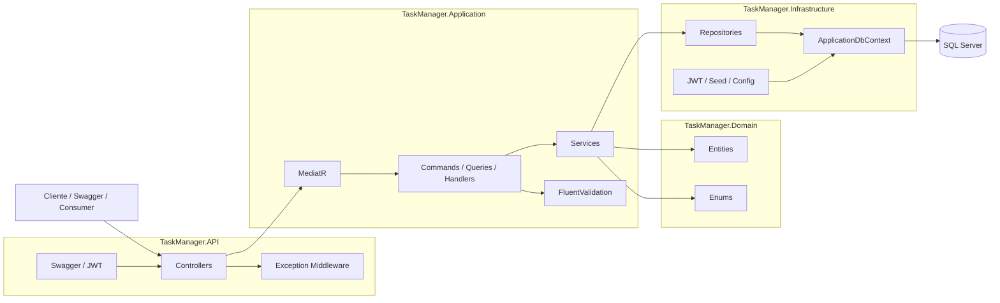
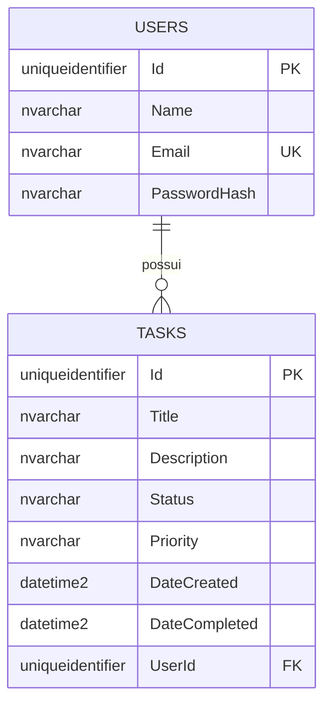
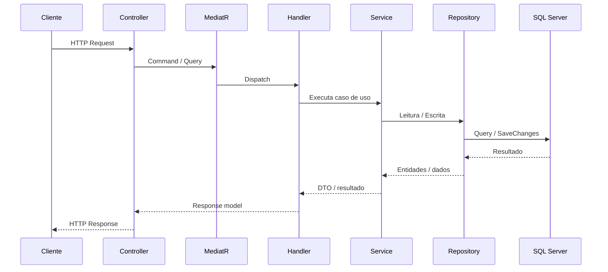

# TaskManager

API REST para gerenciamento de tarefas desenvolvida em .NET 8 como entrega de teste técnico para vaga de perfil Pleno/Senior.

O projeto foi construído com foco em:

- arquitetura em camadas
- separação de responsabilidades
- boas práticas de API REST
- persistência com Entity Framework Core
- facilidade de execução para avaliação local ou via Docker

## 🚀 Início rápido

Se você quiser avaliar o projeto no caminho mais simples:

1. subir com Docker
2. abrir o Swagger
3. fazer login com o usuário admin seed
4. autorizar o token
5. testar os endpoints

Comandos:

```bash
docker compose up --build
```

Swagger:

```text
http://localhost:8080/swagger
```

Login padrão:

```text
email: admin@taskmanager.com
senha: Admin@TaskManager2026
```

## Sumário

- [Visão geral](#visão-geral)
- [Funcionalidades implementadas](#funcionalidades-implementadas)
- [Arquitetura](#arquitetura)
- [Diagramas](#diagramas)
- [Tecnologias utilizadas](#tecnologias-utilizadas)
- [Pré-requisitos](#pré-requisitos)
- [Opção 1 - Execução recomendada com Docker](#opção-1---execução-recomendada-com-docker)
- [Opção 2 - Execução local sem Docker](#opção-2---execução-local-sem-docker)
- [Como validar a API](#como-validar-a-api)
- [Autenticação](#autenticação)
- [Endpoints principais](#endpoints-principais)
- [Estrutura da solução](#estrutura-da-solução)
- [Decisões técnicas e diferenciais](#decisões-técnicas-e-diferenciais)
- [Testes automatizados](#testes-automatizados)
- [Troubleshooting](#troubleshooting)

## 📌 Visão geral

Cada tarefa possui:

- `Id`
- `Title`
- `Description`
- `Status` (`Pending`, `InProgress`, `Completed`)
- `Priority` (`Low`, `Medium`, `High`)
- `DateCreated`
- `DateCompleted`
- `UserId`

Cada usuário possui:

- `Id`
- `Name`
- `Email`
- `PasswordHash`

Relacionamento:

- `1 usuário -> N tarefas`

## ✅ Funcionalidades implementadas

### Obrigatórias

- CRUD completo de usuários
- CRUD completo de tarefas
- relação `1:N` entre usuários e tarefas
- listagem de tarefas com filtros por status, prioridade e usuário
- paginação na listagem de tarefas
- resumo de tarefas por status para um usuário
- validação com FluentValidation
- middleware global de tratamento de erros
- Swagger/OpenAPI configurado
- Entity Framework Core com Code First e Migrations

### Diferenciais implementados

- autenticação JWT com endpoint de login
- testes unitários com xUnit na camada de serviços
- CQRS com MediatR
- Docker Compose com API + SQL Server + migrator
- logs estruturados com Serilog
- cache em memória com IMemoryCache nas listagens
- seed automático de usuário admin para facilitar a avaliação
- índices extras para as consultas mais usadas

## 🧱 Arquitetura

O projeto segue arquitetura em camadas:

- `TaskManager.API`
  - controllers
  - middleware
  - configuração da aplicação
  - Swagger
- `TaskManager.Application`
  - services
  - DTOs
  - validators
  - commands e queries com MediatR
  - interfaces
- `TaskManager.Domain`
  - entidades
  - enums
  - regras centrais do domínio
- `TaskManager.Infrastructure`
  - DbContext
  - configurações do EF Core
  - repositórios
  - migrations
  - autenticação JWT
  - seed inicial
- `TaskManager.Tests`
  - testes unitários da camada de aplicação

Fluxo principal:

`Controller -> MediatR -> Handler -> Service -> Repository -> DbContext`

## 🗺️ Diagramas

### Diagrama de arquitetura



### MER



### Fluxo resumido de uma requisição



## 🛠️ Tecnologias utilizadas

- .NET 8
- ASP.NET Core Web API
- Entity Framework Core 8
- SQL Server / LocalDB
- FluentValidation
- MediatR
- Serilog
- xUnit
- Docker / Docker Compose

## 📦 Pré-requisitos

Existem dois caminhos para executar a aplicação.

### Caminho recomendado

Use **Docker Compose**. Esse é o caminho mais fácil para avaliação porque sobe:

- SQL Server
- migração do banco
- API

### Caminho alternativo

Use execução local com:

- .NET SDK 8.0.420
- SQL Server Express LocalDB

### Downloads oficiais

Se você não tiver as dependências instaladas, use os links oficiais abaixo:

- Git: https://git-scm.com/downloads
- .NET 8 SDK: https://dotnet.microsoft.com/en-us/download/dotnet/8.0
- Guia oficial de instalação do .NET: https://learn.microsoft.com/en-us/dotnet/core/install/
- Guia oficial de instalação do .NET no Windows: https://learn.microsoft.com/en-us/dotnet/core/install/windows
- Guia oficial de instalação do .NET no macOS: https://learn.microsoft.com/en-us/dotnet/core/install/macos
- Guia oficial de instalação do .NET no Linux: https://learn.microsoft.com/en-us/dotnet/core/install/linux
- Docker Desktop geral: https://docs.docker.com/get-started/introduction/get-docker-desktop/
- Docker Desktop para Windows: https://docs.docker.com/desktop/setup/install/windows-install/
- Docker Desktop para macOS: https://docs.docker.com/installation/mac/
- Docker Engine no Linux: https://docs.docker.com/engine/installation/
- Docker Desktop no Linux: https://docs.docker.com/desktop/setup/install/linux/
- SQL Server 2022 Express: https://www.microsoft.com/en-us/download/details.aspx?id=104781&lc=1033&msockid=392adff1f80564130ef1c958f97065fc
- Documentação do SQL Server Express LocalDB: https://learn.microsoft.com/en-us/sql/database-engine/configure-windows/sql-server-express-localdb?view=sql-server-ver17
- SQL Server no Linux: https://learn.microsoft.com/en-us/sql/linux/sql-server-linux-setup
- SQL Server Management Studio (opcional): https://learn.microsoft.com/en-us/ssms/download-sql-server-management-studio-ssms

## 🐳 Opção 1 - Execução recomendada com Docker

Esta é a opção recomendada para **Windows, Linux e macOS**.

### 1. Clonar o repositório

```bash
git clone <URL_DO_REPOSITORIO>
cd task-manager-api
```

### 2. Garantir que o Docker Desktop está rodando

No Windows, abra o Docker Desktop e espere o status ficar como iniciado.

Se quiser validar:

```bash
docker version
docker info
```

### 3. Subir a stack

```bash
docker compose up --build
```

Esse comando faz:

- sobe o SQL Server em container
- aguarda o banco ficar saudável
- executa as migrations
- sobe a API

### 4. Abrir o Swagger

```text
http://localhost:8080/swagger
```

### 5. Parar a stack

```bash
docker compose down
```

### 5.1 Subir novamente sem rebuild

Se as imagens já estiverem prontas e você quiser apenas subir os containers novamente:

```bash
docker compose up -d
```

### 5.2 Acompanhar logs no Docker

Para visualizar os logs da API:

```bash
docker compose logs -f api
```

Para visualizar todos os serviços:

```bash
docker compose logs -f
```

Para verificar os containers ativos:

```bash
docker compose ps
```

### 6. Resetar completamente o ambiente Docker

Se quiser apagar também o banco persistido no volume:

```bash
docker compose down -v
```

> Observação: o Compose usa volume nomeado para o SQL Server. Isso significa que o banco não é perdido em um `docker compose down` comum.

## 💻 Opção 2 - Execução local sem Docker

Esta opção é útil para quem prefere rodar a API diretamente com `dotnet run`.

O projeto sempre precisa de:

- .NET SDK 8
- uma instância SQL Server acessível

O que muda por sistema operacional é a forma mais prática de obter esse SQL Server.

### Windows

No Windows, o caminho mais simples sem Docker é usar `MSSQLLocalDB`, que já está configurado no `appsettings.json` padrão.

### 1. Instalar o .NET SDK correto

O projeto está fixado em:

```json
{
  "sdk": {
    "version": "8.0.420"
  }
}
```

Arquivo: [global.json](</c:/Users/55119/Documents/BOHME solucoes/task-manager-api/global.json:1>)

### 2. Instalar SQL Server Express LocalDB

Se o LocalDB ainda não existir, instale o SQL Server Express / LocalDB pelos links oficiais acima.

Para verificar se o LocalDB está disponível:

```bash
sqllocaldb info
```

Para iniciar a instância padrão:

```bash
sqllocaldb start MSSQLLocalDB
```

### 3. Restaurar dependências

```bash
dotnet restore
dotnet tool restore
```

### 4. Aplicar as migrations

```bash
dotnet ef database update --project TaskManager.Infrastructure --startup-project TaskManager.API
```

### 5. Executar a API

```bash
dotnet run --project TaskManager.API
```

### 6. Abrir o Swagger

```text
http://localhost:5064/swagger
```

### macOS e Linux

No macOS e no Linux, `LocalDB` não existe.

Nesses casos, para rodar **sem Docker**, a API precisa apontar para uma instância SQL Server acessível, por exemplo:

- SQL Server em container
- SQL Server instalado na própria máquina
- SQL Server remoto na rede

Exemplo de connection string:

```json
"ConnectionStrings": {
  "DefaultConnection": "Server=localhost,1433;Database=TaskManagerDb;User Id=sa;Password=TaskManager@123;TrustServerCertificate=True;Encrypt=False;"
}
```

Depois de ajustar a connection string, rode:

```bash
dotnet restore
dotnet tool restore
dotnet ef database update --project TaskManager.Infrastructure --startup-project TaskManager.API
dotnet run --project TaskManager.API
```

> Observação: `LocalDB` não existe em macOS nem em Linux. Nesses sistemas, fora do Docker, é necessário apontar a API para uma instância SQL Server real.

## 🧪 Como validar a API

### Passo 1 - Fazer login

O projeto cria automaticamente um usuário admin para facilitar a avaliação.

Credenciais padrão:

```text
email: admin@taskmanager.com
senha: Admin@TaskManager2026
```

No Swagger:

1. abrir `POST /api/Auth/login`
2. informar email e senha
3. executar
4. copiar o `accessToken` retornado

### Passo 2 - Autorizar no Swagger

1. clicar em `Authorize`
2. informar:

```text
Bearer SEU_TOKEN
```

3. confirmar

### Passo 3 - Testar o fluxo principal

Sugestão de ordem:

1. `GET /api/Users`
2. `POST /api/Users`
3. `GET /api/Users/{id}`
4. `POST /api/Tasks`
5. `GET /api/Tasks`
6. `GET /api/Tasks/summary/{userId}`
7. `PUT /api/Tasks/{id}`
8. `DELETE /api/Tasks/{id}`

## 🔐 Autenticação

- `POST /api/Auth/login` é anônimo
- os demais endpoints estão protegidos com JWT

Formato do login:

```json
{
  "email": "admin@taskmanager.com",
  "password": "Admin@TaskManager2026"
}
```

Formato esperado de resposta:

```json
{
  "accessToken": "jwt-aqui",
  "expiresAt": "2026-04-26T23:59:59Z"
}
```

## 🌐 Endpoints principais

### Auth

- `POST /api/Auth/login`

### Users

- `GET /api/Users`
- `GET /api/Users/{id}`
- `POST /api/Users`
- `PUT /api/Users/{id}`
- `DELETE /api/Users/{id}`

### Tasks

- `GET /api/Tasks`
- `GET /api/Tasks/{id}`
- `GET /api/Tasks/summary/{userId}`
- `POST /api/Tasks`
- `PUT /api/Tasks/{id}`
- `DELETE /api/Tasks/{id}`

### Health

- `GET /api/Health`

> Observação: neste projeto o endpoint de health também está protegido por JWT.

## 🧾 Exemplos de payload

### Criar usuário

```json
{
  "name": "Joao Silva",
  "email": "joao@taskmanager.com",
  "password": "SenhaForte123"
}
```

### Criar tarefa

```json
{
  "title": "Preparar entrega final",
  "description": "Revisar endpoints e documentação",
  "priority": "High",
  "userId": "GUID_DO_USUARIO"
}
```

### Atualizar tarefa

```json
{
  "title": "Preparar entrega final",
  "description": "Revisar endpoints, documentação e testes",
  "status": "InProgress",
  "priority": "High"
}
```

### Filtrar tarefas com paginação

```text
GET /api/Tasks?pageNumber=1&pageSize=10&status=Pending&priority=High
```

## 🗂️ Estrutura da solução

```text
TaskManager/
|- TaskManager.API/
|- TaskManager.Application/
|- TaskManager.Domain/
|- TaskManager.Infrastructure/
|- TaskManager.Tests/
|- TaskManager.sln
|- global.json
|- docker-compose.yml
|- README.md
```

## 💡 Decisões técnicas e diferenciais

### 1. Entity Framework Core com Code First

As tabelas e relações são definidas a partir do código, com migrations versionadas no repositório.

### 2. Repository Pattern

Os acessos ao banco foram encapsulados em repositórios para manter a Application desacoplada da persistência.

### 3. FluentValidation

Os DTOs de entrada são validados antes da execução das regras de negócio.

### 4. Middleware global de exceções

Erros são convertidos para respostas padronizadas e registradas em log.

### 5. JWT

Foi implementado login com emissão de token para proteger os endpoints da API.

### 6. CQRS com MediatR

Foi aplicado CQRS de forma evolutiva:

- controllers enviam `commands` e `queries`
- handlers encapsulam cada caso de uso
- services existentes foram preservados como camada de negócio

### 7. Serilog

Logs estruturados ajudam na observabilidade e facilitam diagnóstico local e em Docker.

### 8. IMemoryCache

As listagens de usuários e tarefas usam cache em memória com invalidação quando há escrita.

### 9. Seed de admin

Foi criado um seed automático e idempotente para reduzir atrito na avaliação.

### 10. Refinos de banco

Foram adicionados índices extras nas tarefas para melhorar consultas de filtro, resumo e ordenação.

## 🧪 Testes automatizados

Para executar os testes:

```bash
dotnet test TaskManager.sln
```

### Executar testes em container SDK

Se quiser validar os testes em ambiente containerizado, sem depender do SDK instalado na máquina host:

```bash
docker run --rm -it -v "${PWD}:/src" -w /src mcr.microsoft.com/dotnet/sdk:8.0 dotnet test TaskManager.sln
```

> Observação: os testes não devem ser executados dentro do container `taskmanager.api`, porque ele é um container de runtime voltado para hospedar a aplicação já publicada. Para testes em container, use uma imagem `mcr.microsoft.com/dotnet/sdk:8.0`.

Atualmente o projeto possui **28 testes unitários aprovados**, focados na camada de serviços.

Os cenários cobertos incluem:

- autenticação com sucesso e falha
- criação, leitura, atualização e exclusão de usuários
- criação, leitura, atualização e exclusão de tarefas
- conflitos de email
- regras de status e conclusão
- listagens com cache e invalidação
- filtros e paginação de tarefas
- resumo de tarefas por status

## 🩹 Troubleshooting

### 1. `dockerDesktopLinuxEngine` não encontrado

O Docker Desktop provavelmente não está rodando.

Solução:

1. abrir o Docker Desktop
2. esperar iniciar completamente
3. rodar novamente:

```bash
docker compose up --build
```

### 2. `dotnet-ef` não encontrado

Rode:

```bash
dotnet tool restore
```

### 3. Erro ao conectar no LocalDB

Verifique se a instância existe:

```bash
sqllocaldb info
sqllocaldb start MSSQLLocalDB
```

### 4. Erro de autenticação no Swagger

Verifique se:

- o login foi executado com sucesso
- o token foi copiado corretamente
- o token foi informado no formato:

```text
Bearer SEU_TOKEN
```

### 5. Resetar o ambiente Docker

Se quiser recriar banco e containers do zero:

```bash
docker compose down -v
docker compose up --build
```

### 6. Erro ao executar `dotnet TaskManager.API.dll` dentro do container da API

Se você entrar manualmente no container `taskmanager.api` e tentar iniciar a aplicação de novo, poderá receber erro de porta em uso.

Exemplo:

```text
Failed to bind to address http://[::]:8080: address already in use
```

Isso acontece porque a API já está rodando como processo principal do container. Nesse caso, o ambiente está correto; basta acessar a aplicação pelo host ou acompanhar os logs com:

```bash
docker compose logs -f api
```

## 📎 Observações finais

Para avaliação rápida, recomendo usar a opção com Docker Compose, tanto em Windows quanto em Linux ou macOS.

Ela exige menos configuração manual, sobe o banco automaticamente, aplica as migrations e deixa a API pronta para uso via Swagger.
